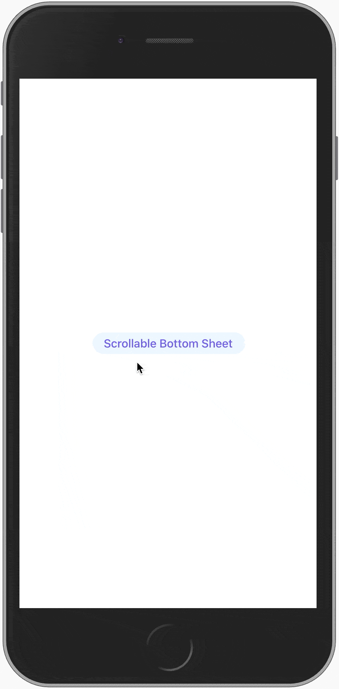

<div align="center" >
  <br/>
  <br/>
  <h1>🪐 React Modal Sheet</h1>
  &middot;
  <i>Flexible bottom sheet component for your React apps</i>
  &middot;
  <br/>
  <br/>
  
  
  <br/>
  <br/>
</div>

|  |  |  |  |
| :--------------: | :--------------: | :--------------: | :--------------: |


## Installation

```sh
npm install react-modal-sheet
```

or if you use `yarn`:

```sh
yarn add react-modal-sheet
```

### Peer dependencies

The gestures and animations are handled by the excellent [Framer Motion](https://github.com/framer/motion) library so before you can start using this library you need to install `framer-motion`:

```sh
npm install framer-motion
```

## Usage

```jsx
import React from 'react';
import Sheet from 'react-modal-sheet';

function Example() {
  const [isOpen, setOpen] = React.useState(false);

  return (
    <>
      <button onClick={() => setOpen(true)}>Open sheet</button>

      <Sheet isOpen={isOpen} onClose={() => setOpen(false)}>
        <Sheet.Container>
          <Sheet.Header />
          <Sheet.Content>{/* Your sheet content goes here */}</Sheet.Content>
        </Sheet.Container>

        <Sheet.Backdrop />
      </Sheet>
    </>
  );
}
```

The `Sheet` component follows the [Compound Component pattern](https://kentcdodds.com/blog/compound-components-with-react-hooks) in order to provide a flexible yet powerful API for creating highly customizable bottom sheet components.

Since the final bottom sheet is composed from smaller building blocks (`Container`, `Content`, `Header`, and `Backdrop`) you are in total control over the rendering output. So for example, if you don't want to have any backdrop in your sheet then you can just skip rendering it instead of passing some prop like `renderBackdrop={false}` to the main sheet component. Cool huh? 😎

Also, by constructing the sheet from smaller pieces makes it easier to apply any necessary accessibility related properties to the right components without requiring the main sheet component to be aware of them. You can read more about accessibility in the [Accessibility](#Accessibility) section.

## Props

| Name           | Required | Default          | Description                                                                                                                                                                                                                       |
| -------------- | -------- | ---------------- | --------------------------------------------------------------------------------------------------------------------------------------------------------------------------------------------------------------------------------- |
| `children`     | yes      |                  | Use `Sheet.Container/Content/Header/Backdrop` to compose your bottom sheet.                                                                                                                                                       |
| `isOpen`       | yes      |                  | Boolean that indicates whether the sheet is open or not.                                                                                                                                                                          |
| `onClose`      | yes      |                  | Callback fn that is called when the sheet is closed by the user.                                                                                                                                                                  |
| `disableDrag`  | no       | false            | Disable drag for the whole sheet.                                                                                                                                                                                                 |
| `onOpenStart`  | no       |                  | Callback fn that is called when the sheet opening animation starts.                                                                                                                                                               |
| `onOpenEnd`    | no       |                  | Callback fn that is called when the sheet opening animation is completed.                                                                                                                                                         |
| `onCloseStart` | no       |                  | Callback fn that is called when the sheet closing animation starts.                                                                                                                                                               |
| `onCloseEnd`   | no       |                  | Callback fn that is called when the sheet closing animation is completed.                                                                                                                                                         |
| `onSnap`       | no       |                  | Callback fn that is called with the current snap point index when the sheet snaps to a new snap point. Requires `snapPoints` prop.                                                                                                |
| `snapPoints`   | no       |                  | Eg. `[-50, 0.5, 100, 0]` - where positive values are pixels from the bottom of the screen and negative from the top. Values between 0-1 represent percentages, eg. `0.5` means 50% of window height from the bottom of the sceen. |
| `initialSnap`  | no       | 0                | Initial snap point when sheet is opened (index from `snapPoints`).                                                                                                                                                                |
| `rootId`       | no       |                  | The id of the element where the main app is mounted, eg. "root". Enables iOS modal effect.                                                                                                                                        |
| `springConfig` | no       | `DEFAULT_SPRING` | Overrides the config for the [spring animation](https://www.framer.com/api/motion/types/#spring).                                                                                                                                 |

**`DEFAULT_SPRING`**

Spring animation happens when the sheet is opened/closed or when it snaps to a snap point.

```js
{
  stiffness: 300,
  damping: 30,
  mass: 0.2,
}
```

## Methods

### `snapTo(index)`

Imperative method that can be accessed via a ref for snapping to a snap point in given index.

```tsx
import React from 'react';
import Sheet, { SheetRef } from 'react-modal-sheet';

function Example() {
  const [isOpen, setOpen] = React.useState(false);
  const ref = React.useRef<SheetRef>();
  const snapTo = (i: number) => ref.current?.snapTo(i);

  return (
    <>
      <button onClick={() => setOpen(true)}>Open sheet</button>

      {/* Opens to 400 since initial index is 1 */}
      <Sheet
        ref={ref}
        isOpen={isOpen}
        onClose={() => setOpen(false)}
        snapPoints={[600, 400, 100, 0]}
        initialSnap={1}
        onSnap={snapIndex =>
          console.log('> Current snap point index:', snapIndex)
        }
      >
        <Sheet.Container>
          <Sheet.Content>
            <button onClick={() => snapTo(0)}>Snap to index 0</button>
            <button onClick={() => snapTo(1)}>Snap to index 1</button>
            <button onClick={() => snapTo(2)}>Snap to index 2</button>
            <button onClick={() => snapTo(3)}>Snap to index 3</button>
          </Sheet.Content>
        </Sheet.Container>
      </Sheet>
    </>
  );
}
```

## Compound Components

### `Sheet.Container`

Sheet container is positioned above the sheet backdrop and by default adds a small shadow and rounded corners to the sheet. `Sheet.Content` and `Sheet.Header` should be rendered inside `Sheet.Container`.

> 🖥 Rendered element: `motion.div`.

### `Sheet.Content`

Sheet content acts as a drag target and makes sure that content which doesn't fit inside the sheet becomes scrollable.

> 🖥 Rendered element: `motion.div`.

#### Content props

| Name          | Required | Default | Description                         |
| ------------- | -------- | ------- | ----------------------------------- |
| `disableDrag` | no       | false   | Disable drag for the sheet content. |

### `Sheet.Header`

Sheet header acts as a drag target and has a dragging direction indicator. Rendering any children inside `Sheet.Header` replaces the default header.

> 🖥 Rendered element: `motion.div`.

#### Header props

| Name          | Required | Default | Description                        |
| ------------- | -------- | ------- | ---------------------------------- |
| `disableDrag` | no       | false   | Disable drag for the sheet header. |

### `Sheet.Backdrop`

Sheet backdrop is a translucent overlay that helps to separate the sheet from it's background. By default the backdrop doesn't have any interaction attached to it but if you, for example, want to close the sheet when the backdrop is clicked you can provide click/tap handlers to it which will change the rendered element from `div` to `button`.

> 🖥 Rendered element: `motion.div` or `motion.button`.

## Advanced usage

### iOS Modal View effect

In addition to the `Sheet.Backdrop` it's possible to apply a scaling effect to the main app element to highlight the modality of the bottom sheet. This effect mimics the [iOS Modal View](https://developer.apple.com/design/human-interface-guidelines/ios/app-architecture/modality/) presentation style to bring more focus to the sheet and add some delight to the user experience.

|  |  |
| :--------------: | :--------------: |


To enable this effect you can provide the id of the root element where your application is mounted:

```jsx
function Example() {
  return <Sheet rootId="root">{/*...*/}</Sheet>;
}
```

> ⚠️ **Limitations**: Since the effect is applied to the root element it will NOT work as desired if the HTML body element is scrolled down at all. One way to avoid this is to use something like `height: 100vh;` and `overflow: auto;` on the root element to make it fill the whole screen and be scrollable instead of the body element.

## Customization

The default styles for the `Sheet` component somewhat follows the styles of the previously mentioned iOS Modal View. However, if these default styles are not to your liking it's easy to make changes to them: you can provide a custom header or you can overwrite any style with CSS via the exposed class names.

### Custom header

Adding a custom header is as simple as providing your own header as the child component to `Sheet.Header`:

```jsx
function Example() {
  return (
    <Sheet>
      <Sheet.Container>
        <Sheet.Header>
          <YourCustomSheetHeader />
        </Sheet.Header>

        <Sheet.Content>{/*...*/}</Sheet.Content>
      </Sheet.Container>

      <Sheet.Backdrop />
    </Sheet>
  );
}
```

### Custom styles

You can add your own styles or override the default sheet styles via the exposed class names. Note that you might need to use `!important` for style overrides since the inner styles are applied as inline styles which have higher specificity.

#### Vanilla CSS

```css
.react-modal-sheet-backdrop {
  /* custom styles */
}
.react-modal-sheet-container {
  /* custom styles */
}
.react-modal-sheet-header {
  /* custom styles */
}
.react-modal-sheet-drag-indicator {
  /* custom styles */
}
.react-modal-sheet-content {
  /* custom styles */
}
```

#### CSS-in-JS

```jsx
import React from 'react';
import styled from 'styled-components';
import Sheet from 'react-modal-sheeet';

const CustomSheet = styled(Sheet)`
  .react-modal-sheet-backdrop {
    /* custom styles */
  }
  .react-modal-sheet-container {
    /* custom styles */
  }
  .react-modal-sheet-header {
    /* custom styles */
  }
  .react-modal-sheet-drag-indicator {
    /* custom styles */
  }
  .react-modal-sheet-content {
    /* custom styles */
  }
`;

function Example() {
  const [isOpen, setOpen] = React.useState(false);

  return (
    <>
      <button onClick={() => setOpen(true)}>Open sheet</button>

      <CustomSheet isOpen={isOpen} onClose={() => setOpen(false)}>
        <CustomSheet.Container>
          <CustomSheet.Header />
          <CustomSheet.Content>{/*...*/}</CustomSheet.Content>
        </CustomSheet.Container>

        <CustomSheet.Backdrop />
      </CustomSheet>
    </>
  );
}
```

## Accessibility

By default, react-modal-sheet doesn't include any built-in accessibility properties in order to not make any assumptions and to support a wide range of use cases. Additionally, not including 3rd party libraries for features like focus trapping or screen reader support makes it possible to utilize any accessibility libraries that your project may already use, eg. [React Aria](https://react-spectrum.adobe.com/react-aria/getting-started.html). This also helps to reduce JS bloat by not including similar libraries multiple times in your app bundle.

The example below utilizes React Aria to achieve an accessible modal-like bottom sheet that can be closed via a button rendered inside a custom sheet header.

> ℹ️ The example was built by following the React Aria's [useDialog](https://react-spectrum.adobe.com/react-aria/useDialog.html) documentation.

```jsx
import React from 'react';
import Sheet from 'react-modal-sheet';
import { useOverlayTriggerState } from '@react-stately/overlays';
import { useOverlay, useModal, OverlayProvider } from '@react-aria/overlays';
import { FocusScope } from '@react-aria/focus';
import { useButton } from '@react-aria/button';
import { useDialog } from '@react-aria/dialog';

const A11yExample = () => {
  const sheetState = useOverlayTriggerState({});
  const openButtonRef = React.useRef(null);
  const openButton = useButton({ onPress: sheetState.open }, openButtonRef);

  return (
    <div>
      <button {...openButton.buttonProps} ref={openButtonRef}>
        Open sheet
      </button>

      <Sheet isOpen={sheetState.isOpen} onClose={sheetState.close}>
        <OverlayProvider>
          <FocusScope contain autoFocus restoreFocus>
            <SheetComp sheetState={sheetState} />
          </FocusScope>
        </OverlayProvider>
      </Sheet>
    </div>
  );
};

const SheetComp = ({ sheetState }) => {
  const containerRef = React.useRef(null);
  const dialog = useDialog({}, containerRef);
  const overlay = useOverlay(
    { onClose: sheetState.close, isOpen: true, isDismissable: true },
    containerRef
  );

  const closeButtonRef = React.useRef(null);
  const closeButton = useButton(
    { onPress: sheetState.close, 'aria-label': 'Close sheet' },
    closeButtonRef
  );

  useModal();

  // In real world usage this would be a separate React component
  const customHeader = (
    <div>
      <span {...dialog.titleProps}>Some title for sheet</span>
      <button {...closeButton.buttonProps}>🅧</button>
    </div>
  );

  return (
    <>
      <Sheet.Container
        {...overlay.overlayProps}
        {...dialog.dialogProps}
        ref={containerRef}
      >
        <Sheet.Header>{customHeader}</Sheet.Header>
        <Sheet.Content>{/*...*/}</Sheet.Content>
      </Sheet.Container>
      <Sheet.Backdrop />
    </>
  );
};
```

If you want to see a more real-world-like implementation you can take a look at the [Slack example](example/components/slack-message/index.tsx) and try out the related [demo](https://temzasse.github.io/react-modal-sheet/#/slack-message) (optimized for mobile).

### Building a reusable sheet

In your projects it might make sense to build a reusable bottom sheet that has all the accessibility features included and can then be easily used in various places in the project. Take a look at the [A11ySheet example](example/components/a11y/A11ySheet.tsx) to get some insight on how to build such a component. By incorporating all the accessibility features inside your own reusable component you don't need to repeat them every time you want to use a bottom sheet in your app.
