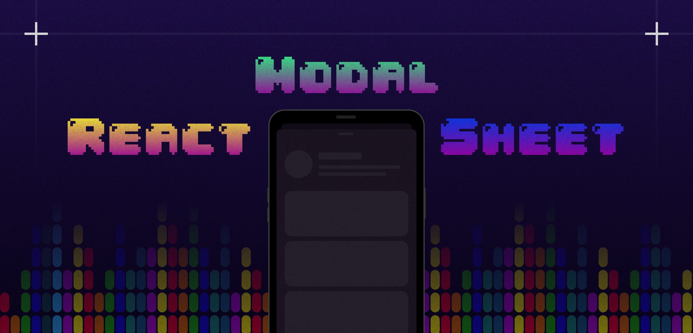
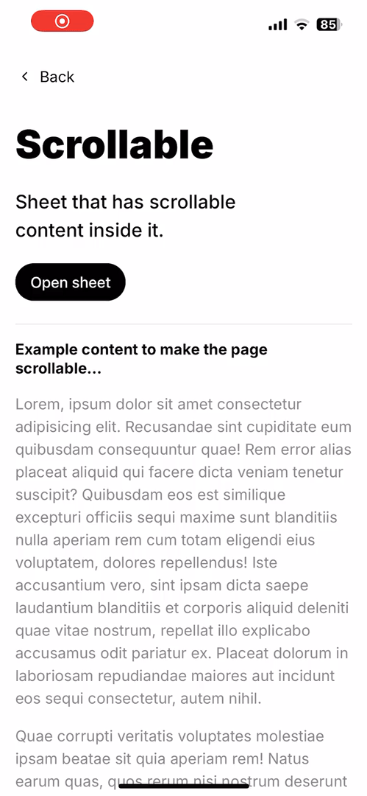

<p align='center'>
  
<p/>

<div align="center" >
  &middot;
  <i>Flexible bottom sheet component for your React apps</i>
  &middot;
  <br/>
  <br/>
  
  
  
  <br/>
  <br/>
</div>

|  |  |  |  |
| :-------------------------------: | :--------------------------------: | :--------------------------------: | :-------------------------------: |

## 📦 Installation

```sh
npm install react-modal-sheet
```

### Peer dependencies

The gestures and animations are handled by the excellent [Motion](https://motion.dev/) library so before you can start using this library you need to install `motion`:

```sh
npm install motion
```

---

<details>
  <summary><strong>📚 Table of contents</strong></summary>
  
  - [What's new in v5](#whats-new-in-v5)
  - [Usage](#-usage)
  - [Props](#%EF%B8%8F-props)
  - [Methods and properties](#%EF%B8%8F-methods-and-properties)
  - [Compound Components](#-compound-components)
  - [Advanced usage](#-advanced-usage)
  - [Customization](#-customization)
  - [Accessibility](#%EF%B8%8F-accessibility)
  - [Troubleshooting](#-troubleshooting)
</details>

---

## 🎉 What's new in v5

Version 5 introduces several major improvements and breaking changes:

### 🔄 Breaking Changes

- **Removed `Sheet.Scroller`**: Scrolling is now handled automatically by `Sheet.Content`
- **Snap point order reversed**: Snap points now use ascending order (e.g., `[0, 0.5, 1]` instead of `[1, 0.5, 0]`)
  - This aligns better with other bottom sheet libraries and makes more intuitive sense
- **Detent prop values changed**:
  - `"full-height"` → `"default"`
  - `"content-height"` → `"content"`
  - New `"full"` detent for viewport-filling sheets

### ✨ New Features

- **Built-in keyboard avoidance**: Best-effort automatic virtual keyboard handling with the `avoidKeyboard` prop
- **Enhanced scroll control**: Dynamic `disableScroll` and `disableDrag` functions with scroll state
- **Improved snap point handling**: Better snap point calculation and more natural snapping between points
- **New sheet properties**: Access `height` and `yInverted` motion values via ref
- **Prevent dismissal**: New `disableDismiss` prop to prevent sheet from being closed by user gestures

### 🔧 Migration from v4

1. Remove all `Sheet.Scroller` components - content is now scrollable by default
2. Reverse your snap point arrays: `[1, 0.5, 0]` → `[0, 0.5, 1]`
3. Update detent props: `detent="full-height"` → `detent="default"`
4. Review virtual keyboard handling - it's now automatic with `avoidKeyboard={true}`

---

## 💻 Usage

```tsx
import { Sheet } from 'react-modal-sheet';
import { useState } from 'react';

function Example() {
  const [isOpen, setOpen] = useState(false);

  return (
    <>
      <button onClick={() => setOpen(true)}>Open sheet</button>

      <Sheet isOpen={isOpen} onClose={() => setOpen(false)}>
        <Sheet.Container>
          <Sheet.Header />
          <Sheet.Content>{/* Your sheet content goes here */}</Sheet.Content>
        </Sheet.Container>
        <Sheet.Backdrop />
      </Sheet>
    </>
  );
}
```

The `Sheet` component follows the [Compound Component pattern](https://kentcdodds.com/blog/compound-components-with-react-hooks) in order to provide a flexible yet powerful API for creating highly customizable bottom sheet components.

Since the final bottom sheet is composed from smaller building blocks (`Container`, `Content`, `Header`, and `Backdrop`) you are in total control over the rendering output. So for example, if you don't want to have any backdrop in your sheet then you can just skip rendering it instead of passing some prop like `renderBackdrop={false}` to the main sheet component. Cool huh? 😎

Also, by constructing the sheet from smaller pieces makes it easier to apply any necessary accessibility related properties to the right components without requiring the main sheet component to be aware of them. You can read more about accessibility in the Accessibility section below.

## 🎛️ Props

| Name                    | Required | Default                              | Description                                                                                                                                                                                                                                                                                                                     |
| ----------------------- | -------- | ------------------------------------ | ------------------------------------------------------------------------------------------------------------------------------------------------------------------------------------------------------------------------------------------------------------------------------------------------------------------------------- |
| `children`              | yes      |                                      | Use `Sheet.Container/Content/Header/Backdrop` to compose your bottom sheet.                                                                                                                                                                                                                                                     |
| `isOpen`                | yes      |                                      | Boolean that indicates whether the sheet is open or not.                                                                                                                                                                                                                                                                        |
| `onClose`               | yes      |                                      | Callback fn that is called when the sheet is closed by the user.                                                                                                                                                                                                                                                                |
| `avoidKeyboard`         | no       | true                                 | Automatically avoid the virtual keyboard by adding bottom padding when the keyboard is open. Only works on mobile devices with [Virtual Keyboard](https://developer.mozilla.org/en-US/docs/Web/API/VirtualKeyboard_API) or [Visual Viewport](https://developer.mozilla.org/en-US/docs/Web/API/Visual_Viewport_API) API support. |
| `disableDrag`           | no       | false                                | Disable drag for the whole sheet.                                                                                                                                                                                                                                                                                               |
| `disableDismiss`        | no       | false                                | Disable dismissing the sheet via dragging or high velocity swipe. When enabled, the sheet can only be closed programmatically.                                                                                                                                                                                                  |
| `disableScrollLocking`  | no       | false                                | Disable scroll locking for the `body` element while sheet is open. Can be useful if you face issues with input elements and the iOS virtual keyboard. See related [issue](https://github.com/Temzasse/react-modal-sheet/issues/135).                                                                                            |
| `detent`                | no       | `'default'`                          | The [detent](https://developer.apple.com/design/human-interface-guidelines/components/presentation/sheets#ios-ipados) in which the sheet should be in when opened. Available values: `'default'`, `'content'`, or `'full'`.                                                                                                     |
| `onOpenStart`           | no       |                                      | Callback fn that is called when the sheet opening animation starts.                                                                                                                                                                                                                                                             |
| `onOpenEnd`             | no       |                                      | Callback fn that is called when the sheet opening animation is completed.                                                                                                                                                                                                                                                       |
| `onCloseStart`          | no       |                                      | Callback fn that is called when the sheet closing animation starts.                                                                                                                                                                                                                                                             |
| `onCloseEnd`            | no       |                                      | Callback fn that is called when the sheet closing animation is completed.                                                                                                                                                                                                                                                       |
| `onSnap`                | no       |                                      | Callback fn that is called with the current snap point index when the sheet snaps to a new snap point. Requires `snapPoints` prop.                                                                                                                                                                                              |
| `snapPoints`            | no       |                                      | Eg. `[0, 0.5, 100, 1]` - where positive values are pixels from the bottom of the sheet and negative from the top. Values between 0-1 represent percentages, eg. `0.5` means 50% of sheet height. **Must be in ascending order and should include 0 (closed) and 1 (fully open).**                                               |
| `initialSnap`           | no       | 0                                    | Initial snap point when sheet is opened (index from `snapPoints`).                                                                                                                                                                                                                                                              |
| `modalEffectRootId`     | no       |                                      | The id of the element where the main app is mounted, eg. "root". Enables [iOS modal effect](#-ios-modal-view-effect).                                                                                                                                                                                                           |
| `modalEffectThreshold`  | no       | 0                                    | Threshold value between 0-1 which determines when the iOS modal effect will start while dragging the sheet - `0` corresponding to the start of the drag (0% has been dragged into view) and `1` corresponding to the end of the drag (100% of the sheet is visible).                                                            |
| `tweenConfig`           | no       | `{ ease: 'easeOut', duration: 0.2 }` | Overrides the config for the sheet [tween](https://motion.dev/docs/react-transitions#tween) transition when the sheet is opened, closed, or snapped to a point.                                                                                                                                                                 |
| `mountPoint`            | no       | `document.body`                      | HTML element that should be used as the mount point for the sheet.                                                                                                                                                                                                                                                              |
| `prefersReducedMotion`  | no       | false                                | Skip sheet animations (sheet instantly snaps to desired location).                                                                                                                                                                                                                                                              |
| `dragVelocityThreshold` | no       | 500                                  | How fast the sheet must be flicked down to close. Higher values make the sheet harder to close.                                                                                                                                                                                                                                 |
| `dragCloseThreshold`    | no       | 0.6                                  | The portion of the sheet which must be dragged off-screen before it will close.                                                                                                                                                                                                                                                 |
| `unstyled`              | no       | false                                | Remove all decorative styles and only apply base functional styles. Useful when you want to completely customize the sheet appearance.                                                                                                                                                                                          |

## ⚙️ Methods and properties

### `snapTo(index)`

Imperative method that can be accessed via a ref for snapping to a snap point in given index.

```tsx
import { Sheet, SheetRef } from 'react-modal-sheet';
import { useState, useRef } from 'react';

const snapPoints = [0, 0.5, 1];

function SnapExample() {
  const [isOpen, setOpen] = useState(false);
  const ref = useRef<SheetRef>(null);
  const snapTo = (i: number) => ref.current?.snapTo(i);

  return (
    <>
      <button onClick={() => setOpen(true)}>Open sheet</button>

      {/* Opens to 50% since initial index is 1 */}
      <Sheet
        ref={ref}
        isOpen={isOpen}
        onClose={() => setOpen(false)}
        initialSnap={1}
        snapPoints={snapPoints}
        onSnap={(snapIndex) =>
          console.log('> Current snap point index:', snapIndex)
        }
      >
        <Sheet.Container>
          <Sheet.Content>
            <button onClick={() => snapTo(0)}>Snap to index 0</button>
            <button onClick={() => snapTo(1)}>Snap to index 1</button>
            <button onClick={() => snapTo(2)}>Snap to index 2</button>
          </Sheet.Content>
        </Sheet.Container>
      </Sheet>
    </>
  );
}
```

### Motion values `y`, `yInverted` and `height`

The `y` value is an internal [MotionValue](https://motion.dev/docs/react-motion-value) that represents the distance to the top most position of the sheet when it is fully open. So for example the `y` value is zero when the sheet is completely open.

The `yInverted` value is the inverse of the `y` value and represents the distance from the bottom of the sheet. This can be useful for certain animations or calculations.

The `height` value represents the current height of the sheet in pixels.

All these values can be accessed via a ref, similar to the `snapTo` method.

Below you can see an example of how to use these values:

```tsx
import { Sheet, SheetRef } from 'react-modal-sheet';
import { useState, useRef } from 'react';

function RefExample() {
  const [isOpen, setOpen] = useState(false);
  const ref = useRef<SheetRef>(null);

  function doSomething() {
    console.log('> Current y value:', ref.current?.y.get());
    console.log('> Current yInverted value:', ref.current?.yInverted.get());
    console.log('> Current height value:', ref.current?.height);
  }

  return (
    <>
      <button onClick={() => setOpen(true)}>Open sheet</button>

      <Sheet ref={ref} isOpen={isOpen} onClose={() => setOpen(false)}>
        <Sheet.Container>
          <Sheet.Content>
            <motion.div style={{ paddingBottom: ref.current?.y }}>
              Use animated y value in some way
            </motion.div>
            {/* Your content here */}
          </Sheet.Content>
        </Sheet.Container>
      </Sheet>
    </>
  );
}
```

### Detents

By default the sheet will take the full height of the page minus top padding and safe area inset. The `detent` prop controls the sheet's height behavior:

- `"default"` - Sheet takes full height minus safe areas (default behavior)
- `"content"` - Sheet height is based on its content
- `"full"` - Sheet takes the entire viewport height with no safe area insets

```tsx
function DetentExample() {
  return (
    <Sheet detent="content">
      <Sheet.Container>
        <Sheet.Content>
          <div style={{ height: 200 }}>Some content</div>
        </Sheet.Content>
      </Sheet.Container>
    </Sheet>
  );
}
```

When using `detent="content"` and the sheet height changes dynamically, the sheet will grow until it hits the maximum default height, after which it becomes scrollable.

It is possible to use snap points with `detent="content"` **but** the snap points are restricted by the content height. For example if one of the snap points is 800px and the sheet height is only 700px then snapping to the 800px snap point would only snap to 700px since otherwise the sheet would become detached from the bottom.

> ℹ️ If you are wondering where the term `detent` comes from it's from Apple's [Human Interface Guidelines](https://developer.apple.com/design/human-interface-guidelines/components/presentation/sheets#ios-ipados).

## 🧩 Compound Components

### `Sheet`

Sheet is the root element that wraps the whole sheet. It renders a fixed positioned wrapper element that covers the whole screen to contain the actual sheet that is animated in (don't worry the root element is not interactive when the sheet is closed). All sheet compound components should be rendered within `Sheet`.

> 🖥 Rendered element: `motion.div`.

### `Sheet.Container`

Sheet container is positioned above the sheet backdrop and by default adds a small shadow and rounded corners to the sheet. `Sheet.Content` and `Sheet.Header` should be rendered inside `Sheet.Container`.

> 🖥 Rendered element: `motion.div`.

### `Sheet.Header`

Sheet header acts as a drag target and has a dragging direction indicator. Rendering any children inside `Sheet.Header` replaces the default header.

> 🖥 Rendered element: `motion.div`.

#### Header props

| Name          | Required | Default | Description                        |
| ------------- | -------- | ------- | ---------------------------------- |
| `disableDrag` | no       | false   | Disable drag for the sheet header. |

### `Sheet.DragIndicator`

Sheet drag indicator renders two small animated lines that indicate the dragging direction. This component is automatically included in `Sheet.Header` but can be used standalone for custom header designs. The indicator lines animate with the sheet's drag state to provide visual feedback.

> 🖥 Rendered element: Two `motion.span` elements.

#### Usage example

```tsx
function CustomHeaderExample() {
  return (
    <Sheet>
      <Sheet.Container>
        <Sheet.Header>
          <div style={{ padding: '16px', textAlign: 'center' }}>
            <h2>Custom Header</h2>
            <Sheet.DragIndicator />
          </div>
        </Sheet.Header>
        <Sheet.Content>
          <p>Sheet content goes here...</p>
        </Sheet.Content>
      </Sheet.Container>
      <Sheet.Backdrop />
    </Sheet>
  );
}
```

### `Sheet.Content`

Sheet content acts as a drag target and handles scrollable content internally. It automatically manages scroll behavior and keyboard avoidance.

> 🖥 Rendered element: `motion.div` (with internal scroller).

#### Content props

| Name            | Required | Default | Description                                                                                                                                                                                 |
| --------------- | -------- | ------- | ------------------------------------------------------------------------------------------------------------------------------------------------------------------------------------------- |
| `disableDrag`   | no       | false   | Disable drag for the sheet content. Can be a boolean or a function that receives `{ scrollPosition, currentSnap }` and returns a boolean for dynamic control.                               |
| `disableScroll` | no       | false   | Disable scrolling. Can be a boolean or a function that receives `{ scrollPosition, currentSnap }` and returns a boolean. Useful for making content only scrollable at specific snap points. |
| `scrollRef`     | no       |         | Optional ref to the internal scroll container for accessing scroll methods.                                                                                                                 |

### `Sheet.Backdrop`

Sheet backdrop is a translucent overlay that helps to separate the sheet from it's background. By default the backdrop doesn't have any interaction attached to it but if you, for example, want to close the sheet when the backdrop is clicked you can provide tap handler to it which will change the rendered element from `div` to `button`.

**⚠️ Note:** as the element is a motion component you need to use [`onTap`](https://motion.dev/docs/react-gestures#tap) instead of `onClick` if you want to add a click handler to it.

> 🖥 Rendered element: `motion.div` or `motion.button`.

## ✨ Advanced behaviors

### ⌨️ Virtual keyboard avoidance

React Modal Sheet v5 includes built-in virtual keyboard avoidance that works automatically on mobile devices.
When the `avoidKeyboard` prop is enabled (which is the default), the sheet will automatically add bottom padding to avoid the virtual keyboard covering input elements.

```tsx
function KeyboardExample() {
  return (
    <Sheet avoidKeyboard>
      <Sheet.Container>
        <Sheet.Header />
        <Sheet.Content>
          <input placeholder="Your input here" />
          <textarea placeholder="Your message here" />
          {/* More form elements */}
        </Sheet.Content>
      </Sheet.Container>
      <Sheet.Backdrop />
    </Sheet>
  );
}
```

The keyboard avoidance feature:

- Uses the `env(keyboard-inset-height)` from [Virtual Keyboard API](https://developer.mozilla.org/en-US/docs/Web/API/VirtualKeyboard_API) and fallbacks to [Visual Viewport API](https://developer.mozilla.org/en-US/docs/Web/API/Visual_Viewport_API) and custom `keyboard-inset-height` CSS environment variable
- Works automatically on mobile devices with virtual keyboard support
- Applies dynamic padding to keep content visible when the keyboard opens
- Disables drag gestures while the keyboard is open to prevent glitches

If you need to disable keyboard avoidance, set `avoidKeyboard={false}`.

> [!NOTE]
> If your sheet content is very long and some inputs are below the keyboard even after adding the padding, you might need to scroll the content into view manually when an input is focused.

### 📱 Scrolling behavior

The `Sheet.Content` component manages scroll interactions internally and provides several ways to control scrolling:

#### Basic scrollable content

```tsx
function ScrollableExample() {
  return (
    <Sheet>
      <Sheet.Container>
        <Sheet.Header />
        <Sheet.Content>
          {/* Long content that needs scrolling */}
          <div style={{ height: '200vh' }}>Long content here...</div>
        </Sheet.Content>
      </Sheet.Container>
      <Sheet.Backdrop />
    </Sheet>
  );
}
```

#### Controlling scroll behavior with snap points

You can disable scrolling conditionally using the `disableScroll` prop. This is useful when you want content to be scrollable only at certain snap points:

```tsx
const snapPoints = [0, 0.5, 1];

function ConditionalScrollExample() {
  return (
    <Sheet snapPoints={snapPoints} initialSnap={1}>
      <Sheet.Container>
        <Sheet.Header />
        <Sheet.Content
          // Only allow scrolling when at the top snap point (index 2)
          disableScroll={(state) => state.currentSnap !== 2}
        >
          <div style={{ height: '200vh' }}>Long content here...</div>
        </Sheet.Content>
      </Sheet.Container>
      <Sheet.Backdrop />
    </Sheet>
  );
}
```

#### Dynamic drag control

Similarly, you can control when dragging is enabled based on scroll position or snap point:

```tsx
function DynamicDragExample() {
  return (
    <Sheet>
      <Sheet.Container>
        <Sheet.Header />
        <Sheet.Content
          // Disable drag when not scrolled to top
          disableDrag={(state) => state.scrollPosition !== 'top'}
        >
          <div style={{ height: '200vh' }}>Long content here...</div>
        </Sheet.Content>
      </Sheet.Container>
      <Sheet.Backdrop />
    </Sheet>
  );
}
```

The scroll state provides:

- `scrollPosition`: `'top'`, `'bottom'`, `'middle'`, or `undefined`
- `currentSnap`: Current snap point index (if using snap points)

### 🪟 iOS Modal View effect

In addition to the `Sheet.Backdrop` it's possible to apply a scaling effect to the main app element to highlight the modality of the bottom sheet. This effect mimics the [iOS Modal View](https://developer.apple.com/design/human-interface-guidelines/ios/app-architecture/modality/) presentation style to bring more focus to the sheet and add some delight to the user experience.

|  |  |
| :-------------------------------------------------------: | :-------------------------------------------------------: |

To enable this effect you can provide the id of the root element where your application is mounted:

```tsx
function Example() {
  return <Sheet modalEffectRootId="root">{/*...*/}</Sheet>;
}
```

> [!IMPORTANT]
> ⚠️ **Limitations**: Since the effect is applied to the root element it will NOT work as desired if the HTML body element is scrolled down at all. One way to avoid this is to use something like `height: 100vh;` and `overflow: auto;` on the root element to make it fill the whole screen and be scrollable instead of the body element. You can check the example apps [root styles](https://github.com/Temzasse/react-modal-sheet/blob/main/example/src/index.css) for a working example of this.

#### Controlling the effect

You can control the start threshold of the effect with the `modalEffectThreshold` prop which should have a value between `0` and `1` representing the fraction at which the effect starts relative to the dragging distance. So for example, a value of `0.5` means the effect will start when the sheet is dragged halfway and `0.7` would mean the effect will start when the sheet is dragged 70% of the way to the top. The default value is `0` which means that the effect will start as soon as the sheet is opened or dragged into view.

> [!NOTE]
> If you are using `snapPoints` the start threshold is calculated based on the
> second snap point so that when the sheet is snapping to the first snap point,
> meaning the sheet is fully open, the effect will only apply for that snap point
> range and not for the whole draggable distance.
>
> This gives a more natural UX and follows the native iOS effect more closely.
>
> You can still override this behavior by providing a custom `modalEffectThreshold` value.

## 🎨 Customization

The default styles for the `Sheet` component somewhat follows the styles of the previously mentioned iOS Modal View. However, if these default styles are not to your liking it's easy to make changes to them: you can provide a custom header or you can overwrite any style with CSS via the exposed class names.

### Custom header

Adding a custom header is as simple as providing your own header as the child component to `Sheet.Header`:

```tsx
function Example() {
  return (
    <Sheet>
      <Sheet.Container>
        <Sheet.Header>
          <YourCustomSheetHeader />
        </Sheet.Header>
        <Sheet.Content>{/*...*/}</Sheet.Content>
      </Sheet.Container>
      <Sheet.Backdrop />
    </Sheet>
  );
}
```

### Custom styles

You can add your own styles or override the default sheet styles via the exposed class names. Note that you might need to use `!important` for style overrides since the inner styles are applied as inline styles which have higher specificity.

#### Unstyled mode

For complete control over the sheet's appearance, you can use the `unstyled` prop to remove all decorative styles while keeping only the essential functional styles.

When `unstyled={true}` is set on the root `Sheet` component, it removes decorative styles like: border radius, shadows, and background colors:

```tsx
function UnstyledExample() {
  return (
    <Sheet unstyled>
      <Sheet.Container>
        <Sheet.Header />
        <Sheet.Content>{/* Your content */}</Sheet.Content>
      </Sheet.Container>
      <Sheet.Backdrop />
    </Sheet>
  );
}
```

The `unstyled` prop can also be applied to individual sheet components to selectively remove their decorative styles:

```tsx
function SelectiveUnstyledExample() {
  return (
    <Sheet>
      <Sheet.Container unstyled>
        <Sheet.Header />
        <Sheet.Content>{/* Your content */}</Sheet.Content>
      </Sheet.Container>
      {/* Keep the backdrop styled */}
      <Sheet.Backdrop />
    </Sheet>
  );
}
```

This is particularly useful when building custom designs or when integrating with design systems that require complete control over styling.

You can also remove all styles at the root level and then override it for individual components if you want to keep some default styles:

```tsx
function MixedUnstyledExample() {
  return (
    <Sheet unstyled>
      <Sheet.Container>
        <Sheet.Header />
        <Sheet.Content>{/* Your content */}</Sheet.Content>
      </Sheet.Container>
      <Sheet.Backdrop unstyled={false} />
    </Sheet>
  );
}
```

### CSS Modules

```tsx
import styles from './styles.css';

function Example() {
  return (
    <Sheet>
      <Sheet.Container className={styles.sheetContainer}>
        <Sheet.Header className={styles.sheetHeader} />
        <Sheet.Content className={styles.sheetContent}>{/*...*/}</Sheet.Content>
      </Sheet.Container>
      <Sheet.Backdrop className={styles.sheetBackdrop} />
    </Sheet>
  );
}
```

```css
/* styles.css */

.sheetContainer {
  /* custom styles */
}
.sheetHeader {
  /* custom styles */
}
.sheetContent {
  /* custom styles */
}
.sheetBackdrop {
  /* custom styles */
}
```

#### Vanilla CSS

You can also use vanilla CSS to override the styles by targeting the exposed class names:

```css
.react-modal-sheet-backdrop {
  /* custom styles */
}
.react-modal-sheet-container {
  /* custom styles */
}
.react-modal-sheet-header {
  /* custom styles */
}
.react-modal-sheet-header-container {
  /* custom styles */
}
.react-modal-sheet-drag-indicator-container {
  /* custom styles */
}
.react-modal-sheet-drag-indicator {
  /* custom styles */
}
.react-modal-sheet-content {
  /* custom styles */
}
```

#### CSS-in-JS

```tsx
import { styled } from 'styled-components'; // or emotion, pandacss, etc.

function Example() {
  return (
    <Sheet>
      <SheetContainer>
        <SheetHeader />
        <SheetContent>{/*...*/}</SheetContent>
      </SheetContainer>
      <SheetBackdrop />
    </Sheet>
  );
}

const SheetContainer = styled(Sheet.Container)`
  /* custom styles */
`;

const SheetHeader = styled(Sheet.Header)`
  /* custom styles */
`;

const SheetContent = styled(Sheet.Content)`
  /* custom styles */
`;

const SheetBackdrop = styled(Sheet.Backdrop)`
  /* custom styles */
`;
```

### Custom styles example

You can customize the sheet quite a lot if you get creative with the styles.

Here's an example how a totally custom sheet could look like:

<p align="center">
  
</p>

See the [CustomStyles](https://github.com/Temzasse/react-modal-sheet/blob/main/example/src/components/CustomStyles.tsx) component to view the full implementation of the above example.

> [!IMPORTANT]
> Wrapping the sheet components with custom elements or components can have unexpected results since the default sheet styles provided by the library rely on the sheet parts being direct children of each other. Some behavious like keyboard avoidance or scroll handling might not work as expected if the sheet parts are not direct children of each other or if you customize the styles too much.

## ♿️ Accessibility

By default, react-modal-sheet doesn't include any built-in accessibility properties in order to not make any assumptions and to support a wide range of use cases. Additionally, not including 3rd party libraries for features like focus trapping or screen reader support makes it possible to utilize any accessibility libraries that your project may already use, eg. [React Aria](https://react-spectrum.adobe.com/react-aria/getting-started.html). This also helps to reduce JS bloat by not including similar libraries multiple times in your app bundle.

The example below utilizes React Aria to achieve an accessible modal-like bottom sheet that can be closed via a button rendered inside a custom sheet header.

> ℹ️ The example was built by following the React Aria's [useDialog](https://react-spectrum.adobe.com/react-aria/useDialog.html) documentation.

```tsx
import { Sheet } from 'react-modal-sheet';
import { useRef } from 'react';
import { useOverlayTriggerState } from 'react-stately';

import {
  useOverlay,
  useModal,
  OverlayProvider,
  FocusScope,
  useButton,
  useDialog,
} from 'react-aria';

function A11yExample() {
  const sheetState = useOverlayTriggerState({});
  const openButtonRef = useRef(null);
  const openButton = useButton({ onPress: sheetState.open }, openButtonRef);

  return (
    <div>
      <button {...openButton.buttonProps} ref={openButtonRef}>
        Open sheet
      </button>

      <Sheet isOpen={sheetState.isOpen} onClose={sheetState.close}>
        <OverlayProvider>
          <FocusScope contain autoFocus restoreFocus>
            <SheetComp sheetState={sheetState} />
          </FocusScope>
        </OverlayProvider>
      </Sheet>
    </div>
  );
}

function SheetComp({ sheetState }) {
  const containerRef = useRef(null);
  const dialog = useDialog({}, containerRef);
  const overlay = useOverlay(
    { onClose: sheetState.close, isOpen: true, isDismissable: true },
    containerRef
  );

  const closeButtonRef = useRef(null);
  const closeButton = useButton(
    { onPress: sheetState.close, 'aria-label': 'Close sheet' },
    closeButtonRef
  );

  useModal();

  // In real world usage this would be a separate React component
  const customHeader = (
    <div>
      <span {...dialog.titleProps}>Some title for sheet</span>
      <button {...closeButton.buttonProps}>🅧</button>
    </div>
  );

  return (
    <>
      <Sheet.Container
        {...overlay.overlayProps}
        {...dialog.dialogProps}
        ref={containerRef}
      >
        <Sheet.Header>{customHeader}</Sheet.Header>
        <Sheet.Content>{/*...*/}</Sheet.Content>
      </Sheet.Container>
      <Sheet.Backdrop />
    </>
  );
}
```

If you want to see a more real-world-like implementation you can take a look at the [Slack example](example/components/slack-message/index.tsx) and try out the related [demo](https://temzasse.github.io/react-modal-sheet/#/slack-message) (optimized for mobile).

### 🔩 Building a reusable sheet

In your projects it might make sense to build a reusable bottom sheet that has all the accessibility features included and can then be easily used in various places in the project. Take a look at the [A11ySheet](example/components/a11y/A11ySheet.tsx) example to get some insight on how to build such a component. By incorporating all the accessibility features inside your own reusable component you don't need to repeat them every time you want to use a bottom sheet in your app.

## 🐛 Troubleshooting

### The sheet doesn't open when using `StrictMode`

If you are using React `StrictMode` the sheet animations might not work as expected. This seems to be an issue in the `motion` library and I haven't been able to find a good solution for it yet. You can see all `motion` issues related to the `StrictMode` [here](https://github.com/motiondivision/motion/issues?q=is%3Aissue+StrictMode). Easiest solution is to just not use `StrictMode` 🤷‍♂️

### Upgrading from v4 to v5

If you're experiencing issues after upgrading, check the "What's new in v5" section above for breaking changes. The most common issues are:

1. **Snap points not working**: Ensure your snap points are in ascending order (`[0, 0.5, 1]` instead of `[1, 0.5, 0]`)
2. **Scrolling issues**: Remove `Sheet.Scroller` components as scrolling is now handled by `Sheet.Content`
3. **Detent errors**: Update detent prop values (`"full-height"` → `"default"`, `"content-height"` → `"content"`)

## 🤝 Contributing

If you find a bug or have a feature request please open an issue. If you want to contribute code please open a pull request.

You can build and run the library and the example app locally like this:

1. First install [yalc](https://github.com/wclr/yalc) globally for managing local package dependencies.

```sh
npm i yalc -g
```

2. Install deps + configure yalc.

```sh
npm install
npm run build
npm run link
```

3. Start a watcher for building the library.

```sh
npm run dev
```

4. Run dev server for the example app (do this in another terminal).

```sh
cd example
npm run dev
```

5. Open http://localhost:5173/ to see the examples. Now if you make edits to the library code the example app will automatically refresh.

> [!TIP]
> If you want to test the example app on your phone you can run the example app with `npm run dev:host` and then open your computer's local IP address in your phone's browser. Make sure your phone is on the same network as your computer.
