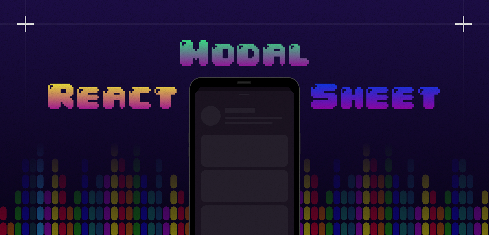
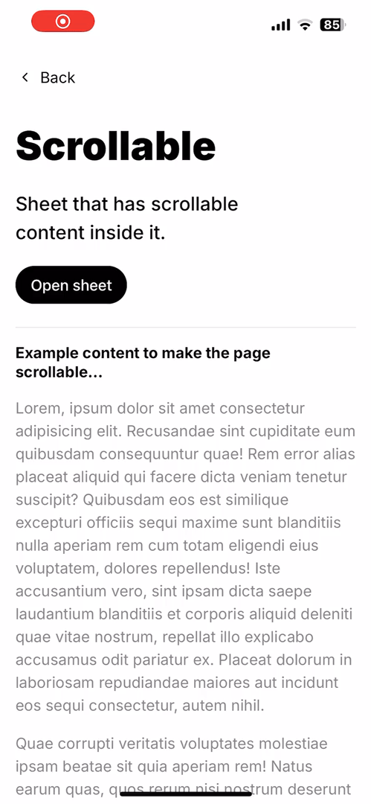

<p align='center'>
  
<p/>

<div align="center" >
  &middot;
  <i>Flexible bottom sheet component for your React apps</i>
  &middot;
  <br/>
  <br/>
  
  
  
  <br/>
  <br/>
</div>

|  |  |  |  |
| :-------------------------------: | :--------------------------------: | :--------------------------------: | :-------------------------------: |

## 📦 Installation

```sh
npm install react-modal-sheet
```

### Peer dependencies

The gestures and animations are handled by the excellent [Motion](https://motion.dev/) library so before you can start using this library you need to install `motion`:

```sh
npm install motion
```

---

<details>
  <summary><strong>📚 Table of contents</strong></summary>
  
  - [Usage](#-usage)
  - [Props](#%EF%B8%8F-props)
  - [Methods and properties](#%EF%B8%8F-methods-and-properties)
  - [Detents](#-detents)
  - [Compound Components](#-compound-components)
  - [Advanced behavior](#-advanced-behavior)
  - [Customization](#-customization)
  - [Accessibility](#%EF%B8%8F-accessibility)
  - [Troubleshooting](#-troubleshooting)
</details>

---

## 💻 Usage

```tsx
import { Sheet } from 'react-modal-sheet';
import { useState } from 'react';

function Example() {
  const [isOpen, setOpen] = useState(false);

  return (
    <>
      <button onClick={() => setOpen(true)}>Open sheet</button>

      <Sheet isOpen={isOpen} onClose={() => setOpen(false)}>
        <Sheet.Container>
          <Sheet.Header />
          <Sheet.Content>{/* Your sheet content goes here */}</Sheet.Content>
        </Sheet.Container>
        <Sheet.Backdrop />
      </Sheet>
    </>
  );
}
```

The `Sheet` component follows the [Compound Component pattern](https://kentcdodds.com/blog/compound-components-with-react-hooks) in order to provide a flexible yet powerful API for creating highly customizable bottom sheet components.

Since the final bottom sheet is composed from smaller building blocks (`Container`, `Content`, `Header`, and `Backdrop`) you are in total control over the rendering output. So for example, if you don't want to have any backdrop in your sheet then you can just skip rendering it instead of passing some prop like `renderBackdrop={false}` to the main sheet component. Cool huh? 😎

Also, by constructing the sheet from smaller pieces makes it easier to apply any necessary accessibility related properties to the right components without requiring the main sheet component to be aware of them. You can read more about accessibility in the Accessibility section below.

## 🎛️ Props

| Name                    | Required | Default                              | Description                                                                                                                                                                                                                                                                                                                     |
| ----------------------- | -------- | ------------------------------------ | ------------------------------------------------------------------------------------------------------------------------------------------------------------------------------------------------------------------------------------------------------------------------------------------------------------------------------- |
| `children`              | yes      |                                      | Use `Sheet.Container/Content/Header/Backdrop` to compose your bottom sheet.                                                                                                                                                                                                                                                     |
| `isOpen`                | yes      |                                      | Boolean that indicates whether the sheet is open or not.                                                                                                                                                                                                                                                                        |
| `onClose`               | yes      |                                      | Callback fn that is called when the sheet is closed by the user.                                                                                                                                                                                                                                                                |
| `avoidKeyboard`         | no       | true                                 | Automatically avoid the virtual keyboard by adding bottom padding when the keyboard is open. Only works on mobile devices with [Virtual Keyboard](https://developer.mozilla.org/en-US/docs/Web/API/VirtualKeyboard_API) or [Visual Viewport](https://developer.mozilla.org/en-US/docs/Web/API/Visual_Viewport_API) API support. |
| `disableDrag`           | no       | false                                | Disable drag for the whole sheet.                                                                                                                                                                                                                                                                                               |
| `disableDismiss`        | no       | false                                | Disable dismissing the sheet via dragging or high velocity swipe. When enabled, the sheet can only be closed programmatically.                                                                                                                                                                                                  |
| `disableScrollLocking`  | no       | false                                | Disable scroll locking for the `body` element while sheet is open. Can be useful if you face issues with input elements and the iOS virtual keyboard. See related [issue](https://github.com/Temzasse/react-modal-sheet/issues/135).                                                                                            |
| `detent`                | no       | `'default'`                          | The [detent](https://developer.apple.com/design/human-interface-guidelines/components/presentation/sheets#ios-ipados) in which the sheet should be in when opened. Available values: `'default'`, `'content'`, or `'full'`.                                                                                                     |
| `onOpenStart`           | no       |                                      | Callback fn that is called when the sheet opening animation starts.                                                                                                                                                                                                                                                             |
| `onOpenEnd`             | no       |                                      | Callback fn that is called when the sheet opening animation is completed.                                                                                                                                                                                                                                                       |
| `onCloseStart`          | no       |                                      | Callback fn that is called when the sheet closing animation starts.                                                                                                                                                                                                                                                             |
| `onCloseEnd`            | no       |                                      | Callback fn that is called when the sheet closing animation is completed.                                                                                                                                                                                                                                                       |
| `onSnap`                | no       |                                      | Callback fn that is called with the current snap point index when the sheet snaps to a new snap point. Requires `snapPoints` prop.                                                                                                                                                                                              |
| `snapPoints`            | no       |                                      | Eg. `[0, 0.5, 100, 1]` - where positive values are pixels from the bottom of the sheet and negative from the top. Values between 0-1 represent percentages, eg. `0.5` means 50% of sheet height. **Must be in ascending order and should include 0 (closed) and 1 (fully open).**                                               |
| `initialSnap`           | no       | 0                                    | Initial snap point when sheet is opened (index from `snapPoints`).                                                                                                                                                                                                                                                              |
| `modalEffectRootId`     | no       |                                      | The id of the element where the main app is mounted, eg. "root". Enables [iOS modal effect](#-ios-modal-view-effect).                                                                                                                                                                                                           |
| `modalEffectThreshold`  | no       | 0                                    | Threshold value between 0-1 which determines when the iOS modal effect will start while dragging the sheet - `0` corresponding to the start of the drag (0% has been dragged into view) and `1` corresponding to the end of the drag (100% of the sheet is visible).                                                            |
| `tweenConfig`           | no       | `{ ease: 'easeOut', duration: 0.2 }` | Overrides the config for the sheet [tween](https://motion.dev/docs/react-transitions#tween) transition when the sheet is opened, closed, or snapped to a point.                                                                                                                                                                 |
| `mountPoint`            | no       | `document.body`                      | HTML element that should be used as the mount point for the sheet.                                                                                                                                                                                                                                                              |
| `prefersReducedMotion`  | no       | false                                | Skip sheet animations (sheet instantly snaps to desired location).                                                                                                                                                                                                                                                              |
| `dragVelocityThreshold` | no       | 500                                  | How fast the sheet must be flicked down to close. Higher values make the sheet harder to close.                                                                                                                                                                                                                                 |
| `dragCloseThreshold`    | no       | 0.6                                  | The portion of the sheet which must be dragged off-screen before it will close.                                                                                                                                                                                                                                                 |
| `unstyled`              | no       | false                                | Remove all decorative styles and only apply base functional styles. Useful when you want to completely customize the sheet appearance.                                                                                                                                                                                          |

## ⚙️ Methods and properties

React Modal Sheet exposes several methods and properties that can be accessed via a ref or the sheet context.

These allow you to imperatively control the sheet's behavior and access its internal state.

| Name            | Type                      | Description                                                                                                                                                                                                                  |
| --------------- | ------------------------- | ---------------------------------------------------------------------------------------------------------------------------------------------------------------------------------------------------------------------------- |
| `y`             | `MotionValue<number>`     | Current sheet Y position where `0` means fully open at the top.                                                                                                                                                              |
| `yInverted`     | `MotionValue<number>`     | Inverse of `y`, representing distance from the bottom of the sheet.                                                                                                                                                          |
| `yProgress`     | `MotionValue<number>`     | Normalized open progress from `0` (closed) to `1` (fully open).                                                                                                                                                              |
| `height`        | `number`                  | Current measured sheet height in pixels.                                                                                                                                                                                     |
| `currentSnap`   | `number \| undefined`     | Current active snap point index. `undefined` when snap points are not used.                                                                                                                                                  |
| `snapPoints`    | `SheetSnapPoint[]`        | Computed snap points with: `snapIndex` index of the snap point, `snapValue` computed pixel value (maps to given `snapPoints` prop values - eg. `0.5` becomes an actual pixel value), `snapValueY` inverted snap pixel value. |
| `snapTo(index)` | `(index: number) => void` | Imperatively snaps the sheet to a snap point index. Requires `snapPoints` prop. Index `0` closes the sheet.                                                                                                                  |

There are two ways to access sheet methods and properties:

1. Via a ref using `useRef`

```tsx
import { Sheet, type SheetRef } from 'react-modal-sheet';
import { useRef } from 'react';

function RefExample() {
  const sheetRef = useRef<SheetRef>(null);

  // Then use eg. `sheetRef.current.snapTo()` or `sheetRef.current.y`, etc.

  return (
    <Sheet ref={sheetRef}>
      <Sheet.Container>
        <Sheet.Header />
        <Sheet.Content>{/* Your content here */}</Sheet.Content>
      </Sheet.Container>
      <Sheet.Backdrop />
    </Sheet>
  );
}
```

> [!IMPORTANT]
> [React's rules about refs](https://react.dev/reference/react/useRef#caveats) apply here so don't read the sheet ref during render. If you need to access sheet methods or properties during render, use the `Sheet.useContext` hook instead.

2. Via the `Sheet.useContext` hook from any child component of the sheet

```tsx
import { Sheet } from 'react-modal-sheet';

function ContextExample() {
  return (
    <Sheet>
      <SheetContainer />
      <Sheet.Backdrop />
    </Sheet>
  );
}

/**
 * NOTE: you need to define a separate component for using the `Sheet.useContext`
 * hook since it can only be used within the sheet component tree.
 */
function SheetContainer() {
  const context = Sheet.useContext();

  // Then use eg. `context.snapTo()` or `context.y`, etc.

  return (
    <Sheet.Container>
      <Sheet.Header />
      <Sheet.Content>{/* Your content here */}</Sheet.Content>
    </Sheet.Container>
  );
}
```

> [!TIP]
> You generally want to prefer the `Sheet.useContext` hook when possible since it doesn't require you to manage refs and works seamlessly with React's declarative nature. However, there are some cases where using a ref might be more convenient, eg. when you need to access sheet methods from outside the sheet component tree.
>
> If you want to avoid creating a separate component just for using the `Sheet.useContext` hook, you can also create a reusable component that uses render-props pattern to expose the sheet context:
>
> ```tsx
> import { ReactNode } from 'react';
> import { Sheet, type SheetContext } from 'react-modal-sheet';
>
> // Generic render-prop helper component
> function WithSheetContext({
>   children,
> }: {
>   children: (context: SheetContext) => ReactNode;
> }) {
>   const context = Sheet.useContext();
>   return <>{children(context)}</>;
> }
>
> // Usage
> function ContextExample() {
>   return (
>     <Sheet snapPoints={[0, 0.5, 1]} initialSnap={1}>
>       <WithSheetContext>
>         {(context) => (
>           <Sheet.Container>
>             <Sheet.Header />
>             <Sheet.Content>
>               <button onClick={() => context.snapTo(2)}>
>                 Snap to index 2
>               </button>
>             </Sheet.Content>
>           </Sheet.Container>
>         )}
>       </WithSheetContext>
>     </Sheet>
>   );
> }
> ```

### `snapTo(index)`

Imperative method for snapping to a snap point in given index.

```tsx
import { Sheet, type SheetRef } from 'react-modal-sheet';
import { useState, useRef } from 'react';

const snapPoints = [0, 0.5, 1];

function SnapExample() {
  const [isOpen, setOpen] = useState(false);
  const sheetRef = useRef<SheetRef>(null);
  const snapTo = (i: number) => sheetRef.current?.snapTo(i);

  return (
    <>
      <button onClick={() => setOpen(true)}>Open sheet</button>

      {/* Opens to 50% since initial index is 1 */}
      <Sheet
        ref={sheetRef}
        isOpen={isOpen}
        onClose={() => setOpen(false)}
        initialSnap={1}
        snapPoints={snapPoints}
        onSnap={(snapIndex) =>
          console.log('Current snap point index:', snapIndex)
        }
      >
        <Sheet.Container>
          <Sheet.Content>
            <button onClick={() => snapTo(0)}>Snap to index 0</button>
            <button onClick={() => snapTo(1)}>Snap to index 1</button>
            <button onClick={() => snapTo(2)}>Snap to index 2</button>
          </Sheet.Content>
        </Sheet.Container>
      </Sheet>
    </>
  );
}
```

### Internal Motion values

The `y`, `yInverted`, and `yProgress` values are [MotionValues](https://motion.dev/docs/react-motion-value). The `y` value is the core animated value that drives the sheet's position while dragging and snapping whereas `yInverted` and `yProgress` are derived from `y` and can be used for various animation effects or calculations based on the sheet's position.

- The `y` value represents the distance to the top most position of the sheet when it is fully open. So for example the `y` value is zero when the sheet is completely open.
- The `yInverted` value is the inverse of the `y` value and represents the distance from the bottom of the sheet. This can be useful for certain animations or calculations.
- The `yProgress` value is a normalized value between 0 and 1 that represents how open the sheet is, where 0 means fully closed and 1 means fully open. This can be useful for triggering animations or effects based on how open the sheet is.

Below you can see an example of how to use these values:

```tsx
import { Sheet, type SheetRef } from 'react-modal-sheet';
import { useTransform, interpolate } from 'motion/react';
import { useRef } from 'react';

function RefExample() {
  const sheetRef = useRef<SheetRef>(null);

  /**
   * Example 1: Fade out an element as the sheet gets close to being fully open:
   * - y: 0% - 50% → opacity 1
   * - y: 50% - 60% → opacity fades from 1 to 0
   * - y: 60% - 100% → opacity stays at 0
   */
  const opacity = useTransform(() => {
    const progress = sheetRef?.yProgress.get() ?? 0;
    const mix = interpolate([0, 0.5, 0.6], [1, 1, 0]);
    return mix(progress);
  });

  return <Sheet ref={sheetRef}>{/* ... */}</Sheet>;
}

function ContextExample() {
  return (
    <Sheet>
      <InnerComponent />
    </Sheet>
  );
}

function InnerComponent() {
  const context = Sheet.useContext();

  /**
   * Example 2: Add padding to some content based on how far the sheet is dragged:
   * - y: 0px - 100px → padding 16px to 8px
   * - y: 100px - 200px → padding 8px to 0px
   * - y: > 200px → padding 0px
   */
  const padding = useTransform(context.yInverted, (value) => {
    const mix = interpolate([0, 100, 200], [16, 8, 0]);
    return mix(value);
  });
}
```

### Animating based on snap points

One cool technique you can use is to animate properties based on the snap point thresholds.

For example, you can easily create a custom hook that takes an array of output values corresponding to the snap points and returns a `MotionValue` that updates as the sheet is dragged and snaps to different points:

```tsx
import { interpolate, useTransform } from 'motion/react';
import { Sheet } from 'react-modal-sheet';

export function useSnapPointTransform(
  /** The output values corresponding to the snap points. Must have the same length as snap points array */
  output: number[],
  /** The default value to return during the first render when snap points are not yet calculated */
  defaultValue?: number
) {
  const { snapPoints, y } = Sheet.useContext();

  return useTransform(y, (val) => {
    const firstValue = output[0];

    if (firstValue === undefined) {
      throw new Error('Output array must have at least one value');
    }

    if (snapPoints.length === 0) {
      return defaultValue ?? firstValue;
    }

    if (output.length !== snapPoints.length) {
      throw new Error('Output array must have the same length as snap points');
    }

    const mix = interpolate(
      snapPoints.map((point) => point.snapValueY),
      output
    );

    return mix(val);
  });
}

function SnapPointAnimationExample() {
  return (
    // Provide snap points that `useSnapPointTransform` can use for interpolation
    <Sheet snapPoints={[0, 0.5, 0.7, 1]}>
      <SheetContainer>
        <Sheet.Header />
        <Sheet.Content> {/* Some content here */}</Sheet.Content>
      </SheetContainer>
      <SheetBackdrop />
    </Sheet>
  );
}

function SheetContainer({ children }: { children: ReactNode }) {
  /**
   * Example: Animate border radius based on snap points:
   * - snap point 0 - 1: border radius 32px
   * - snap point 1 - 2: border radius 32px to 8px
   * - snap point 2 - 3: border radius 8px to 0px
   * - snap point 3: border radius 0px
   */
  const borderRadius = useSnapPointTransform([32, 32, 8, 0]);

  return (
    <Sheet.Container
      style={{
        borderTopRightRadius: borderRadius,
        borderTopLeftRadius: borderRadius,
      }}
    >
      {children}
    </Sheet.Container>
  );
}

function SheetBackdrop() {
  // Fade in the backdrop between last two snap points
  const opacity = useSnapPointTransform([0, 0, 0, 1]);

  const backgroundColor = useMotionTemplate`
    background-color: rgba(0, 0, 0, ${opacity});
  `;

  return <Sheet.Backdrop style={{ backgroundColor }} />;
}
```

See the [Apple Maps example](https://temzasse.github.io/react-modal-sheet/#/apple-maps) for a real-world example of this technique for animating elements based on snap point thresholds.

#### Making scrollable sheet content always reachable

One potential use case for the `y` value is to apply padding bottom to the sheet content when the sheet is not fully open. This ensures that the content is always reachable even when the sheet is partially open, eg. when using snap points.

> [!TIP]
> Take a look at the [Creating custom scrollers](#creating-custom-scrollers) section for more advanced use cases when you need to implement your own scroller and potentially apply this padding behavior to that.

```tsx
import { Sheet, type SheetRef } from 'react-modal-sheet';
import { useTransform } from 'motion/react';
import { useState, useRef } from 'react';

const snapPoints = [0, 0.5, 1];

function PaddingExample() {
  const [isOpen, setOpen] = useState(false);
  const sheetRef = useRef<SheetRef>(null);

  // Add padding bottom based on how far the sheet is from being fully open
  const paddingBottom = useTransform(() => {
    return sheetRef.current?.y.get() ?? 0;
  });

  return (
    <>
      <button onClick={() => setOpen(true)}>Open sheet</button>

      <Sheet
        ref={sheetRef}
        isOpen={isOpen}
        onClose={() => setOpen(false)}
        snapPoints={snapPoints}
        initialSnap={1}
      >
        <Sheet.Container>
          <Sheet.Header />
          <Sheet.Content
            // 👇 Apply styles to the inner scroller element
            scrollStyle={{ paddingBottom }}
            // 💡 Recommendation: disable drag for the content so that it doesn't interfere with scrolling
            disableDrag
          >
            This content will always be reachable even when the sheet is not
            fully open.
          </Sheet.Content>
        </Sheet.Container>
      </Sheet>
    </>
  );
}
```

## 🪜 Detents

By default the sheet will take the full height of the page minus top padding and safe area inset. The `detent` prop controls the sheet's height behavior:

- `"default"` - Sheet takes full height minus safe areas (default behavior)
- `"content"` - Sheet height is based on its content
- `"full"` - Sheet takes the entire viewport height with no safe area insets

```tsx
function DetentExample() {
  return (
    <Sheet detent="content">
      <Sheet.Container>
        <Sheet.Content>
          <div style={{ height: 200 }}>Some content</div>
        </Sheet.Content>
      </Sheet.Container>
    </Sheet>
  );
}
```

When using `detent="content"` and the sheet height changes dynamically, the sheet will grow until it hits the maximum default height, after which it becomes scrollable.

It is possible to use snap points with `detent="content"` **but** the snap points are restricted by the content height. For example if one of the snap points is 800px and the sheet height is only 700px then snapping to the 800px snap point would only snap to 700px since otherwise the sheet would become detached from the bottom.

> ℹ️ If you are wondering where the term `detent` comes from it's from Apple's [Human Interface Guidelines](https://developer.apple.com/design/human-interface-guidelines/components/presentation/sheets#ios-ipados).

## 🧩 Compound Components

### `Sheet`

Sheet is the root element that wraps the whole sheet. It renders a fixed positioned wrapper element that covers the whole screen to contain the actual sheet that is animated in (don't worry the root element is not interactive when the sheet is closed). All sheet compound components should be rendered within `Sheet`.

> 🖥 Rendered element: `motion.div`.

### `Sheet.Container`

Sheet container is positioned above the sheet backdrop and by default adds a small shadow and rounded corners to the sheet. `Sheet.Content` and `Sheet.Header` should be rendered inside `Sheet.Container`.

> 🖥 Rendered element: `motion.div`.

### `Sheet.Header`

Sheet header acts as a drag target and has a dragging direction indicator. Rendering any children inside `Sheet.Header` replaces the default header.

> 🖥 Rendered element: `motion.div`.

#### Header props

| Name          | Required | Default | Description                        |
| ------------- | -------- | ------- | ---------------------------------- |
| `disableDrag` | no       | false   | Disable drag for the sheet header. |

### `Sheet.DragIndicator`

Sheet drag indicator renders two small animated lines that indicate the dragging direction. This component is automatically included in `Sheet.Header` but can be used standalone for custom header designs. The indicator lines animate with the sheet's drag state to provide visual feedback.

> 🖥 Rendered element: Two `motion.span` elements.

#### Usage example

```tsx
function CustomHeaderExample() {
  return (
    <Sheet>
      <Sheet.Container>
        <Sheet.Header>
          <div style={{ padding: '16px', textAlign: 'center' }}>
            <h2>Custom Header</h2>
            <Sheet.DragIndicator />
          </div>
        </Sheet.Header>
        <Sheet.Content>
          <p>Sheet content goes here...</p>
        </Sheet.Content>
      </Sheet.Container>
      <Sheet.Backdrop />
    </Sheet>
  );
}
```

### `Sheet.Content`

Sheet content acts as a drag target and handles scrollable content internally. It automatically manages scroll behavior and keyboard avoidance.

> 🖥 Rendered element: `motion.div` (with internal scroller).

#### Content props

| Name            | Required | Default | Description                                                                                                                                                                                 |
| --------------- | -------- | ------- | ------------------------------------------------------------------------------------------------------------------------------------------------------------------------------------------- |
| `disableDrag`   | no       | false   | Disable drag for the sheet content. Can be a boolean or a function that receives `{ scrollPosition, currentSnap }` and returns a boolean for dynamic control.                               |
| `disableScroll` | no       | false   | Disable scrolling. Can be a boolean or a function that receives `{ scrollPosition, currentSnap }` and returns a boolean. Useful for making content only scrollable at specific snap points. |
| `scrollRef`     | no       |         | Optional ref to the internal scroll container for accessing scroll methods.                                                                                                                 |

### `Sheet.Backdrop`

Sheet backdrop is a translucent overlay that helps to separate the sheet from it's background. By default the backdrop doesn't have any interaction attached to it but if you, for example, want to close the sheet when the backdrop is clicked you can provide tap handler to it which will change the rendered element from `div` to `button`.

**⚠️ Note:** as the element is a motion component you need to use [`onTap`](https://motion.dev/docs/react-gestures#tap) instead of `onClick` if you want to add a click handler to it.

> 🖥 Rendered element: `motion.div` or `motion.button`.

## ✨ Advanced behavior

### ⌨️ Virtual keyboard avoidance

React Modal Sheet includes built-in virtual keyboard avoidance that works automatically on mobile devices.
When the `avoidKeyboard` prop is enabled (which is the default), the sheet will automatically add bottom padding to avoid the virtual keyboard covering input elements.

```tsx
function KeyboardExample() {
  return (
    <Sheet avoidKeyboard>
      <Sheet.Container>
        <Sheet.Header />
        <Sheet.Content>
          <input placeholder="Your input here" />
          <textarea placeholder="Your message here" />
          {/* More form elements */}
        </Sheet.Content>
      </Sheet.Container>
      <Sheet.Backdrop />
    </Sheet>
  );
}
```

Virtual keyboard avoidance consists of several key features:

- Uses the `env(keyboard-inset-height)` from [Virtual Keyboard API](https://developer.mozilla.org/en-US/docs/Web/API/VirtualKeyboard_API) and fallbacks to [Visual Viewport API](https://developer.mozilla.org/en-US/docs/Web/API/Visual_Viewport_API) and custom `keyboard-inset-height` CSS environment variable.
- Works automatically on mobile devices with virtual keyboard support.
- Applies dynamic padding to keep content visible when the keyboard opens.
- Scrolls the focused input into view if it's covered by the keyboard.
- Disables drag gestures while the keyboard is open to prevent glitches.
- When using snap points, the sheet will be automatically moved up to the last snap point to ensure that all content is reachable (even when the content is scrollable) within the sheet when the keyboard is open.

> [!NOTE]
> Avoiding the virtual keyboard is a complex problem and the built-in avoidance may not work perfectly in all cases or on all devices. The library does its best to handle the most common scenarios but there may be edge cases where it doesn't work as expected.
>
> Mobile browsers, eg. Android Chrome, may try to automatically move the focused input into view when the keyboard opens which might interfere with the built-in keyboard avoidance behavior causing the sheet content to jump around.
>
> If you need to disable the built-in keyboard avoidance, set `avoidKeyboard={false}`.

#### Managing virtual keyboard manually

If the built-in keyboard avoidance doesn't work for your use case, you can disable it with `avoidKeyboard={false}` and manage the keyboard state manually with the help of the `useVirtualKeyboard` hook.

```tsx
import { Sheet, useVirtualKeyboard } from 'react-modal-sheet';

function ManualKeyboardExample() {
  const [isOpen, setOpen] = useState(false);

  // This hook manages the `--keyboard-inset-height` CSS variable for you
  useVirtualKeyboard({ isEnabled: isOpen });

  return (
    // Disable default keyboard avoidance
    <Sheet avoidKeyboard={false} isOpen={isOpen} onClose={() => setOpen(false)}>
      <Sheet.Container>
        <Sheet.Header />
        <Sheet.Content
          // Apply keyboard height as padding bottom to keep content above the keyboard
          style={{ paddingBottom: 'var(--keyboard-inset-height)' }}
        >
          {/* Your content here */}
        </Sheet.Content>
      </Sheet.Container>
      <Sheet.Backdrop />
    </Sheet>
  );
}
```

For a more detailed example of using `useVirtualKeyboard` see the [Creating custom scrollers](#creating-custom-scrollers) section below.

### 📱 Scrolling behavior

The `Sheet.Content` component manages scroll interactions internally and provides several ways to control scrolling:

#### Basic scrollable content

```tsx
function ScrollableExample() {
  return (
    <Sheet>
      <Sheet.Container>
        <Sheet.Header />
        <Sheet.Content>
          {/* Long content that needs scrolling */}
          <div style={{ height: '200vh' }}>Long content here...</div>
        </Sheet.Content>
      </Sheet.Container>
      <Sheet.Backdrop />
    </Sheet>
  );
}
```

#### Controlling scroll behavior with snap points

You can disable scrolling conditionally using the `disableScroll` prop. This is useful when you want content to be scrollable only at certain snap points:

```tsx
const snapPoints = [0, 0.5, 1];

function ConditionalScrollExample() {
  return (
    <Sheet snapPoints={snapPoints} initialSnap={1}>
      <Sheet.Container>
        <Sheet.Header />
        <Sheet.Content
          // Only allow scrolling when at the top snap point (index 2)
          disableScroll={(state) => state.currentSnap !== 2}
        >
          <div style={{ height: '200vh' }}>Long content here...</div>
        </Sheet.Content>
      </Sheet.Container>
      <Sheet.Backdrop />
    </Sheet>
  );
}
```

#### Dynamic drag control

Similarly, you can control when dragging is enabled based on scroll position or snap point:

```tsx
function DynamicDragExample() {
  return (
    <Sheet>
      <Sheet.Container>
        <Sheet.Header />
        <Sheet.Content
          // Disable drag when not scrolled to top
          disableDrag={(state) => state.scrollPosition !== 'top'}
        >
          <div style={{ height: '200vh' }}>Long content here...</div>
        </Sheet.Content>
      </Sheet.Container>
      <Sheet.Backdrop />
    </Sheet>
  );
}
```

The scroll state provides:

- `scrollPosition`: `'top'`, `'bottom'`, `'middle'`, or `undefined`
- `currentSnap`: Current snap point index (if using snap points)

#### Creating custom scrollers

If you need more control over the scrollable area, eg. when you don't want the whole content area to be scrollable, you can disable the default scrolling behavior of the `Sheet.Content` and implement your own scroller with the help of `useScrollPosition` and `useVirtualKeyboard` utility hooks.

> [!NOTE]
> These hooks are internally used by the `Sheet.Content` component so you shouldn't need to use them unless you are implementing a custom scroller. However they are general purpose hooks so you can use them in other parts of your app as well if you want 😊

```tsx
import {
  Sheet,
  useScrollPosition,
  useVirtualKeyboard,
} from 'react-modal-sheet';

function CustomScrollerExample() {
  const [isOpen, setOpen] = useState(false);

  const { scrollRef, scrollPosition } = useScrollPosition({
    isEnabled: isOpen,
  });

  const { keyboardHeight } = useVirtualKeyboard({
    isEnabled: isOpen,
  });

  /**
   * If you use `var(--keyboard-inset-height)` CSS variable you can just call
   * `useVirtualKeyboard()` without destructuring anything from it:
   *
   * useVirtualKeyboard({ isEnabled: isOpen });
   */

  return (
    // Disable default keyboard avoidance
    <Sheet avoidKeyboard={false} isOpen={isOpen} onClose={() => setOpen(false)}>
      <Sheet.Container>
        <Sheet.Header />
        <Sheet.Content
          // Disable default scrolling
          disableScroll
          // Dragging is still managed by `Sheet.Content` so we control it here
          disableDrag={scrollPosition !== 'top'}
        >
          <div
            style={{
              // Use CSS variable managed by `useVirtualKeyboard`
              paddingBottom: 'var(--keyboard-inset-height)',
              // Alternatively apply keyboard padding via pixel value (maybe you want to add some extra padding to it)
              paddingBottom: keyboardHeight,
              // Some layout styles for custom content
              height: '100%',
              display: 'grid',
              gridTemplateRows: 'auto 1fr auto',
            }}
          >
            <div>Some content here...</div>

            <div
              // Pass ref to the custom scroller so we can track its scroll position
              ref={scrollRef}
              // Make it scrollable
              style={{ overflowY: 'auto' }}
            >
              <div style={{ height: '400vh' }}>Long content here...</div>
            </div>

            <div>More content here...</div>
          </div>
        </Sheet.Content>
      </Sheet.Container>
      <Sheet.Backdrop />
    </Sheet>
  );
}
```

### 🪟 iOS Modal View effect

In addition to the `Sheet.Backdrop` it's possible to apply a scaling effect to the main app element to highlight the modality of the bottom sheet. This effect mimics the [iOS Modal View](https://developer.apple.com/design/human-interface-guidelines/ios/app-architecture/modality/) presentation style to bring more focus to the sheet and add some delight to the user experience.

|  |  |
| :-------------------------------------------------------: | :-------------------------------------------------------: |

To enable this effect you can provide the id of the root element where your application is mounted:

```tsx
function Example() {
  return <Sheet modalEffectRootId="root">{/*...*/}</Sheet>;
}
```

> [!IMPORTANT]
> ⚠️ **Limitations**: Since the effect is applied to the root element it will NOT work as desired if the HTML body element is scrolled down at all. One way to avoid this is to use something like `height: 100vh;` and `overflow: auto;` on the root element to make it fill the whole screen and be scrollable instead of the body element. You can check the example apps [root styles](https://github.com/Temzasse/react-modal-sheet/blob/main/example/src/index.css) for a working example of this.

#### Controlling the effect

You can control the start threshold of the effect with the `modalEffectThreshold` prop which should have a value between `0` and `1` representing the fraction at which the effect starts relative to the dragging distance. So for example, a value of `0.5` means the effect will start when the sheet is dragged halfway and `0.7` would mean the effect will start when the sheet is dragged 70% of the way to the top. The default value is `0` which means that the effect will start as soon as the sheet is opened or dragged into view.

> [!NOTE]
> If you are using `snapPoints` the start threshold is calculated based on the
> second snap point so that when the sheet is snapping to the first snap point,
> meaning the sheet is fully open, the effect will only apply for that snap point
> range and not for the whole draggable distance.
>
> This gives a more natural UX and follows the native iOS effect more closely.
>
> You can still override this behavior by providing a custom `modalEffectThreshold` value.

## 🎨 Customization

The default styles for the `Sheet` component somewhat follows the styles of the previously mentioned iOS Modal View. However, if these default styles are not to your liking it's easy to make changes to them: you can provide a custom header or you can overwrite any style with CSS via the exposed class names.

### Custom header

Adding a custom header is as simple as providing your own header as the child component to `Sheet.Header`:

```tsx
function Example() {
  return (
    <Sheet>
      <Sheet.Container>
        <Sheet.Header>
          <YourCustomSheetHeader />
        </Sheet.Header>
        <Sheet.Content>{/*...*/}</Sheet.Content>
      </Sheet.Container>
      <Sheet.Backdrop />
    </Sheet>
  );
}
```

### Custom styles

You can add your own styles or override the default sheet styles via the exposed class names. Note that you might need to use `!important` for style overrides since the inner styles are applied as inline styles which have higher specificity.

#### Unstyled mode

For complete control over the sheet's appearance, you can use the `unstyled` prop to remove all decorative styles while keeping only the essential functional styles.

When `unstyled={true}` is set on the root `Sheet` component, it removes decorative styles like: border radius, shadows, and background colors:

```tsx
function UnstyledExample() {
  return (
    <Sheet unstyled>
      <Sheet.Container>
        <Sheet.Header />
        <Sheet.Content>{/* Your content */}</Sheet.Content>
      </Sheet.Container>
      <Sheet.Backdrop />
    </Sheet>
  );
}
```

The `unstyled` prop can also be applied to individual sheet components to selectively remove their decorative styles:

```tsx
function SelectiveUnstyledExample() {
  return (
    <Sheet>
      <Sheet.Container unstyled>
        <Sheet.Header />
        <Sheet.Content>{/* Your content */}</Sheet.Content>
      </Sheet.Container>
      {/* Keep the backdrop styled */}
      <Sheet.Backdrop />
    </Sheet>
  );
}
```

This is particularly useful when building custom designs or when integrating with design systems that require complete control over styling.

You can also remove all styles at the root level and then override it for individual components if you want to keep some default styles:

```tsx
function MixedUnstyledExample() {
  return (
    <Sheet unstyled>
      <Sheet.Container>
        <Sheet.Header />
        <Sheet.Content>{/* Your content */}</Sheet.Content>
      </Sheet.Container>
      <Sheet.Backdrop unstyled={false} />
    </Sheet>
  );
}
```

### CSS Modules

```tsx
import styles from './styles.css';

function Example() {
  return (
    <Sheet>
      <Sheet.Container className={styles.sheetContainer}>
        <Sheet.Header className={styles.sheetHeader} />
        <Sheet.Content className={styles.sheetContent}>{/*...*/}</Sheet.Content>
      </Sheet.Container>
      <Sheet.Backdrop className={styles.sheetBackdrop} />
    </Sheet>
  );
}
```

```css
/* styles.css */

.sheetContainer {
  /* custom styles */
}
.sheetHeader {
  /* custom styles */
}
.sheetContent {
  /* custom styles */
}
.sheetBackdrop {
  /* custom styles */
}
```

#### Vanilla CSS

You can also use vanilla CSS to override the styles by targeting the exposed class names:

```css
.react-modal-sheet-backdrop {
  /* custom styles */
}
.react-modal-sheet-container {
  /* custom styles */
}
.react-modal-sheet-header {
  /* custom styles */
}
.react-modal-sheet-header-container {
  /* custom styles */
}
.react-modal-sheet-drag-indicator-container {
  /* custom styles */
}
.react-modal-sheet-drag-indicator {
  /* custom styles */
}
.react-modal-sheet-content {
  /* custom styles */
}
```

#### CSS-in-JS

```tsx
import { styled } from 'styled-components'; // or emotion, pandacss, etc.

function Example() {
  return (
    <Sheet>
      <SheetContainer>
        <SheetHeader />
        <SheetContent>{/*...*/}</SheetContent>
      </SheetContainer>
      <SheetBackdrop />
    </Sheet>
  );
}

const SheetContainer = styled(Sheet.Container)`
  /* custom styles */
`;

const SheetHeader = styled(Sheet.Header)`
  /* custom styles */
`;

const SheetContent = styled(Sheet.Content)`
  /* custom styles */
`;

const SheetBackdrop = styled(Sheet.Backdrop)`
  /* custom styles */
`;
```

### Custom styles example

You can customize the sheet quite a lot if you get creative with the styles.

Here's an example how a totally custom sheet could look like:

<p align="center">
  
</p>

See the [CustomStyles](https://github.com/Temzasse/react-modal-sheet/blob/main/example/src/components/CustomStyles.tsx) component to view the full implementation of the above example.

> [!IMPORTANT]
> Wrapping the sheet components with custom elements or components can have unexpected results since the default sheet styles provided by the library rely on the sheet parts being direct children of each other. Some behavious like keyboard avoidance or scroll handling might not work as expected if the sheet parts are not direct children of each other or if you customize the styles too much.

## ♿️ Accessibility

By default, react-modal-sheet doesn't include any built-in accessibility properties in order to not make any assumptions and to support a wide range of use cases. Additionally, not including 3rd party libraries for features like focus trapping or screen reader support makes it possible to utilize any accessibility libraries that your project may already use, eg. [React Aria](https://react-spectrum.adobe.com/react-aria/getting-started.html). This also helps to reduce JS bloat by not including similar libraries multiple times in your app bundle.

The example below utilizes React Aria to achieve an accessible modal-like bottom sheet that can be closed via a button rendered inside a custom sheet header.

> ℹ️ The example was built by following the React Aria's [useDialog](https://react-spectrum.adobe.com/react-aria/useDialog.html) documentation.

```tsx
import { Sheet } from 'react-modal-sheet';
import { useRef } from 'react';
import { useOverlayTriggerState } from 'react-stately';

import {
  useOverlay,
  useModal,
  OverlayProvider,
  FocusScope,
  useButton,
  useDialog,
} from 'react-aria';

function A11yExample() {
  const sheetState = useOverlayTriggerState({});
  const openButtonRef = useRef(null);
  const openButton = useButton({ onPress: sheetState.open }, openButtonRef);

  return (
    <div>
      <button {...openButton.buttonProps} ref={openButtonRef}>
        Open sheet
      </button>

      <Sheet isOpen={sheetState.isOpen} onClose={sheetState.close}>
        <OverlayProvider>
          <FocusScope contain autoFocus restoreFocus>
            <SheetComp sheetState={sheetState} />
          </FocusScope>
        </OverlayProvider>
      </Sheet>
    </div>
  );
}

function SheetComp({ sheetState }) {
  const containerRef = useRef(null);
  const dialog = useDialog({}, containerRef);
  const overlay = useOverlay(
    { onClose: sheetState.close, isOpen: true, isDismissable: true },
    containerRef
  );

  const closeButtonRef = useRef(null);
  const closeButton = useButton(
    { onPress: sheetState.close, 'aria-label': 'Close sheet' },
    closeButtonRef
  );

  useModal();

  // In real world usage this would be a separate React component
  const customHeader = (
    <div>
      <span {...dialog.titleProps}>Some title for sheet</span>
      <button {...closeButton.buttonProps}>🅧</button>
    </div>
  );

  return (
    <>
      <Sheet.Container
        {...overlay.overlayProps}
        {...dialog.dialogProps}
        ref={containerRef}
      >
        <Sheet.Header>{customHeader}</Sheet.Header>
        <Sheet.Content>{/*...*/}</Sheet.Content>
      </Sheet.Container>
      <Sheet.Backdrop />
    </>
  );
}
```

If you want to see a more real-world-like implementation you can take a look at the [Slack example](example/components/slack-message/index.tsx) and try out the related [demo](https://temzasse.github.io/react-modal-sheet/#/slack-message) (optimized for mobile).

### 🔩 Building a reusable sheet

In your projects it might make sense to build a reusable bottom sheet that has all the accessibility features included and can then be easily used in various places in the project. Take a look at the [A11ySheet](example/components/a11y/A11ySheet.tsx) example to get some insight on how to build such a component. By incorporating all the accessibility features inside your own reusable component you don't need to repeat them every time you want to use a bottom sheet in your app.

## 🐛 Troubleshooting

### The sheet doesn't open when using `StrictMode`

If you are using React `StrictMode` the sheet animations might not work as expected. This seems to be an issue in the `motion` library and I haven't been able to find a good solution for it yet. You can see all `motion` issues related to the `StrictMode` [here](https://github.com/motiondivision/motion/issues?q=is%3Aissue+StrictMode). Easiest solution is to just not use `StrictMode` 🤷‍♂️

### Upgrading from v4 to v5

The most common migration issues are:

1. **Snap points not working**: Ensure your snap points are in ascending order (`[0, 0.5, 1]` instead of `[1, 0.5, 0]`)
2. **Scrolling issues**: Remove `Sheet.Scroller` components as scrolling is now handled by `Sheet.Content`
3. **Detent errors**: Update detent prop values (`"full-height"` → `"default"`, `"content-height"` → `"content"`)

## 🤝 Contributing

If you find a bug or have a feature request please open an issue. If you want to contribute code please open a pull request.

You can build and run the library and the example app locally like this:

1. First install [yalc](https://github.com/wclr/yalc) globally for managing local package dependencies.

```sh
npm i yalc -g
```

2. Install deps + configure yalc.

```sh
npm install
npm run build
npm run link
```

3. Start a watcher for building the library.

```sh
npm run dev
```

4. Run dev server for the example app (do this in another terminal).

```sh
cd example
npm run dev
```

5. Open http://localhost:5173/ to see the examples. Now if you make edits to the library code the example app will automatically refresh.

> [!TIP]
> If you want to test the example app on your phone you can run the example app with `npm run dev:host` and then open your computer's local IP address in your phone's browser. Make sure your phone is on the same network as your computer.
